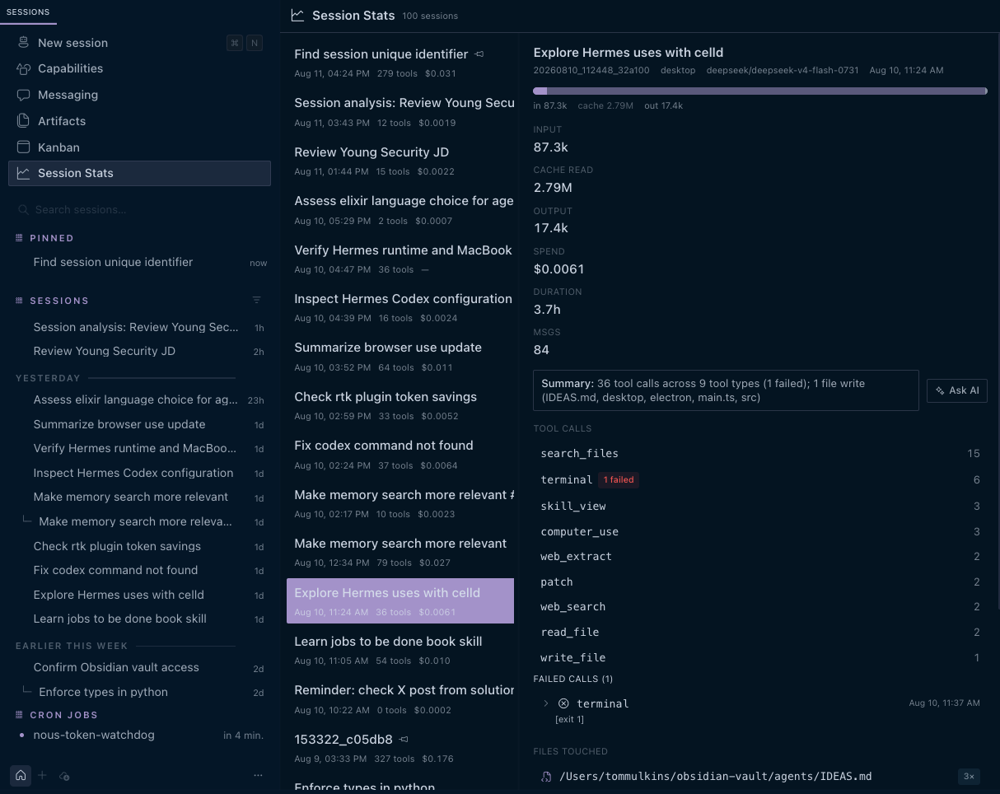

# Hermes Session Stats

Per-session analytics for the **Hermes Desktop** app: tool calls, token/cache
usage, spend, files touched, failed calls — plus an **Ask AI** button that
opens a new session analyzing what went wrong and how to improve the next one.



## What you get

- **Session list** — last 100 sessions: title, date, tool count, cost
- **Per-session detail** — input/output/cache tokens, spend, duration, message
  count, deterministic summary, tool-call breakdown
- **Failed calls** — every failed tool call with its error string, click to
  expand and see the tool's arguments
- **Files touched** — reads and writes, written files highlighted
- **Ask AI** — one click opens a new session with a ready-made analysis
  prompt (copied to your clipboard). Paste, pick your judge model, send.
  No API keys, no config — it uses your existing Hermes.

## Requirements

- Hermes Desktop (the plugin registers a sidebar row + ⌘K command)
- macOS / Linux / Windows (any platform Hermes Desktop runs on)

## Install

```bash
git clone https://github.com/tommulkins/hermes-plugin-session-stats.git
cd hermes-plugin-session-stats
./install.sh
```

Then **restart Hermes Desktop** (⌘Q and reopen) so the backend mounts.

Open it via the sidebar **“Session Stats”** row (graph icon) or **⌘K →
“Session Stats: Open”**.

> The desktop UI hot-reloads, but the Python backend only mounts at startup —
> the restart is required once after installing.

## Update

```bash
cd hermes-plugin-session-stats
git pull
./install.sh        # idempotent — copies new files, never duplicates config
```

Restart Hermes Desktop again to pick up backend changes.

## Uninstall

```bash
rm -rf ~/.hermes/desktop-plugins/session-dashboard
rm -rf ~/.hermes/plugins/session-dashboard
```

Then remove `session-dashboard` from `plugins.enabled` in
`~/.hermes/config.yaml` (or leave it — a missing plugin is ignored), and
restart Hermes Desktop.

## How it works

Two cooperating halves, both read-only over the session store
(`~/.hermes/state.db`):

| Half | Location | What it does |
|---|---|---|
| Desktop plugin | `~/.hermes/desktop-plugins/session-dashboard/plugin.js` | UI: page, sidebar row, ⌘K, drag-resize divider, Ask AI |
| Backend API | `~/.hermes/plugins/session-dashboard/dashboard/` | FastAPI routes over `state.db`: `/sessions`, `/sessions/{id}` with token/cost/failure aggregates |

The backend reads `sessions`, `messages`, and `session_model_usage` tables
directly — it never writes. Token, cache, and cost figures are the same
numbers the app records per turn.

**Ask AI** calls the gateway's `session.create` RPC (no prompt submit — you
choose the model), copies a self-contained analysis prompt to your clipboard,
and navigates you to the new session.

## Files

```
hermes-plugin-session-stats/
├── install.sh                                    # idempotent installer
├── desktop-plugins/session-dashboard/plugin.js   # UI (hot-reloads)
└── plugins/session-dashboard/dashboard/
    ├── manifest.json                             # backend manifest
    └── plugin_api.py                             # FastAPI over state.db
```

## License

MIT
