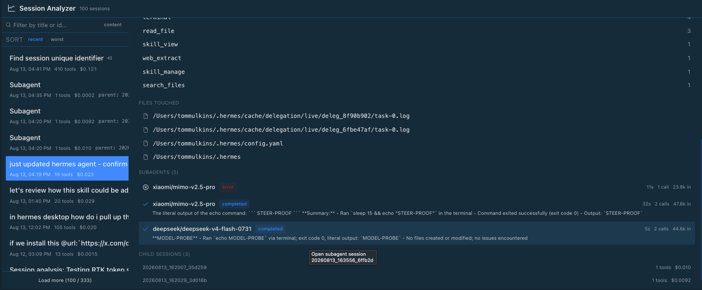

# Hermes Session Analyzer

Per-session analytics for the **Hermes Desktop** app: tool calls, token/cache
usage, spend, files touched, failed calls, search — plus an **Ask AI** button
that opens a new session analyzing what went wrong and how to improve the next
one.


## What you get

- **Session list** — title, date, tool count, cost; **Load more** up to 500
- **Search** — two modes:
  - **Title filter** — live substring match on title or session id as you
    type (searches all sessions)
  - **Content search** — toggle to `content` for FTS search over message text
    (the same index Hermes' own session search uses), with `>>>snippet<<<`
    context per match
- **Sort** — `recent` or `worst` (most failed tool calls first, red
  "N failed" badge per row)
- **Per-session detail** — input/output/cache tokens, spend, duration, message
  count, deterministic summary, tool-call breakdown
- **Tool calls** — per-tool call counts and estimated tokens pushed back into
  context, aligned columns with a labeled header row (`tool / calls / ~tokens`)
- **Failed calls** — every failed tool call with its error string, click to
  expand and see the tool's arguments _and_ the extracted failure detail
  (structured error first, ANSI-stripped output tail)
- **Files touched** — reads and writes, written files highlighted, its own
  full-width section below the tool calls
- **Cache-reset / re-bill events** — model switches, 503 retries, and
  compactions each invalidate the prompt cache; each event is listed with a
  one-line plain-language summary of what happened and what it costs you
- **Context growth** — sparkline of cumulative transcript tokens with the
  biggest single jump and the deepest-reasoning turn (annotated with the tools
  that ran there), plus one-line explanations of why each matters
- **Repeated calls** — identical (tool + arguments) calls 3+ times grouped as
  one root-cause problem instead of N failures
- **Session lineage** — open-session link, and origin labeling (spawned by /
  continuation of / follow-up to) with click-through to the parent
- **Copy session id** — right-click any session row, or the id line in the
  detail panel, or click the copy icon next to it
- **Ask AI** — one click opens a new session with a ready-made analysis
  prompt (copied to your clipboard). Paste, pick your judge model, send.
  No API keys, no config — it uses your existing Hermes.



- **Subagents** — every subagent spawned by the session: model, status
  (completed / error), summary, duration, calls, input tokens — click one to
  jump to its own session detail. Child sessions listed with tool count and
  cost; unnamed subagent rows are labeled `Subagent` with their parent id.

## Requirements

- Hermes Desktop (the plugin registers a sidebar row + ⌘K command)
- macOS / Linux / Windows (any platform Hermes Desktop runs on)

## Install

**macOS / Linux:**

```bash
git clone https://github.com/tommulkins/hermes-plugin-session-analyzer.git
cd hermes-plugin-session-analyzer
chmod +x install.sh
./install.sh
```

**Windows (PowerShell):**

```powershell
git clone https://github.com/tommulkins/hermes-plugin-session-analyzer.git
cd hermes-plugin-session-analyzer
powershell -ExecutionPolicy Bypass -File .\install.ps1
```

The installer copies both halves into your Hermes home — `%LOCALAPPDATA%\hermes`
on Windows, `~/.hermes` elsewhere (honouring a custom `HERMES_HOME` if set) —
and adds the plugin to `plugins.enabled` in config.yaml. It is idempotent:
safe to re-run after updates.

Then **restart Hermes Desktop** (⌘Q / quit and reopen) so the backend mounts.

Open it via the sidebar **"Session Analyzer"** row (graph icon) or **⌘K →
"Session Analyzer: Open"** (Ctrl+K on Windows).

> The desktop UI hot-reloads, but the Python backend only mounts at startup —
> the restart is required once after installing.

### Multiple Hermes profiles

The desktop UI half is shared, but the Python backend is **per-profile**. If
you run Hermes under a profile (e.g. `hermes --profile web-dev`), the plugin
only works in sessions for that profile once **both** are true:

1. `~/.hermes/profiles/<profile>/plugins/session-dashboard/` exists (copy it
   from `~/.hermes/plugins/session-dashboard/`), and
2. `plugins.enabled` in `~/.hermes/profiles/<profile>/config.yaml` lists
   `session-dashboard`.

Without that, the sidebar row appears but every data call fails (the backend
never mounted for that profile). The backend reads that profile's own session
database, so a profile sees only its own sessions. Backend changes require a
restart of that profile's Hermes instance.

## Install via Hermes

Already have Hermes running? Copy this prompt into a session:

```text
Install the Session Analyzer plugin from https://github.com/tommulkins/hermes-plugin-session-analyzer following the README install instructions (clone and run install.sh), then restart Hermes Desktop so the backend mounts.
```

## Update

```bash
cd hermes-plugin-session-analyzer
git pull
chmod +x install.sh     # needed once per fresh clone
./install.sh            # macOS/Linux — idempotent, never duplicates config
powershell -ExecutionPolicy Bypass -File .\install.ps1   # Windows
```

Restart Hermes Desktop again to pick up backend changes.

## Uninstall

**macOS / Linux:**

```bash
rm -rf ~/.hermes/desktop-plugins/session-dashboard
rm -rf ~/.hermes/plugins/session-dashboard
```

**Windows (PowerShell):**

```powershell
$home = "$env:LOCALAPPDATA\hermes"   # or your HERMES_HOME if you set one
Remove-Item -Recurse -Force "$home\desktop-plugins\session-dashboard"
Remove-Item -Recurse -Force "$home\plugins\session-dashboard"
```

Then remove `session-dashboard` from `plugins.enabled` in
`~/.hermes/config.yaml` (or leave it — a missing plugin is ignored), and
restart Hermes Desktop.

## How it works

Two cooperating halves, both read-only over the session store
(`~/.hermes/state.db`):

| Half           | Location                                                | What it does                                                                                     |
| -------------- | ------------------------------------------------------- | ------------------------------------------------------------------------------------------------ |
| Desktop plugin | `~/.hermes/desktop-plugins/session-dashboard/plugin.js` | UI: page, sidebar row, ⌘K, drag-resize divider, Ask AI                                           |
| Backend API    | `~/.hermes/plugins/session-dashboard/dashboard/`        | FastAPI routes over `state.db`: `/sessions`, `/sessions/{id}` with token/cost/failure aggregates |

The backend reads `sessions`, `messages`, and `session_model_usage` tables
directly — it never writes. Token, cache, and cost figures are the same
numbers the app records per turn.

**Ask AI** copies a self-contained analysis prompt to your clipboard and opens
a fresh draft chat (the app's own new-chat door — no pre-created session, so
ownership always resolves). Paste, choose the model, send.

## Files

```
hermes-plugin-session-analyzer/
├── install.sh                                     # macOS/Linux installer
├── install.ps1                                    # Windows installer
├── desktop/plugin.js                              # UI (hot-reloads)
├── dashboard/
│   ├── manifest.json                              # backend manifest
│   └── plugin_api.py                              # FastAPI over state.db
├── plugin.yaml                                    # native manifest (plugin catalog)
└── tests/
    ├── test_plugin_api.py                         # unit tests (pytest)
    └── test_acceptance_live.py                    # acceptance over real state.db
```

### Tests

```bash
~/.hermes/hermes-agent/venv/bin/pytest tests/ -q     # unit + acceptance
pnpm lint                                            # plugin lint gate (loader traps, packaged-CSS gaps)
pnpm lint:test                                       # lint rule self-tests
```

## Support

Found a bug, or have an idea for making Session Analyzer better? Open an
issue — we read them all and tag fixes with release versions:

- **Report issues:** https://github.com/tommulkins/hermes-plugin-session-analyzer/issues
- **See releases:** https://github.com/tommulkins/hermes-plugin-session-analyzer/releases

## License

MIT
